# Rafael IoT SDK 2.1.0

### Environment Setup Guide

## Recommended Tool Versions
| Tool              | Version       | Notes                                           |
| ----------------- | ------------- | ----------------------------------------------- |
| ARM GNU Toolchain | 14.2          | Official precompiled binaries                   |
| CMake             | 3.31          | Requires support for `Presets` and Ninja        |
| Ninja             | 1.11          | Typically used with CMake                       |
| Git               | 2.39 or later | Git LFS recommended                             |
| Python            | 3.10 or later | Used for CMake scripts and toolchain management |
| VS Code           | 1.96 or later | Recommended with CMake Tools / Cortex-Debug     |
| J-Link            | v6.88a        | Recommended for flashing MCU firmware           |

## 1. Install VS Code
  **VS Code Website:** https://code.visualstudio.com/  
  Choose the appropriate version (Windows/Mac/Linux)
  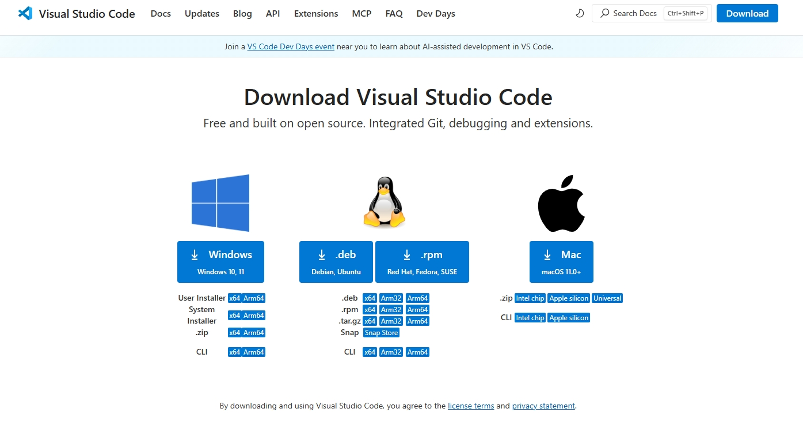
  
# Install Visual Studio Code (Default Settings)

1. Download the **Windows Installer** (User Installer recommended).  
2. Run the installer. During installation, you can safely leave all default options checked, including:  
   - Add **"Open with Code"** action to context menu  
   - Add to **PATH**  
   - Register as the default editor for supported file types  
3. Click **Install** to start the installation.  
4. Once installed, you can launch VS Code from the **Start menu**.  

> Default settings are sufficient. You can customize later via **File > Preferences > Settings**.


  Verify Installed Version (Windows / Linux)

  1. Open the command tool:
      - **Windows** → Command Prompt
      - **Linux** → Terminal
  2. Type the command:
      ```bash
      code -v
      ```

## 2. Install Python
- Python Website: https://www.python.org/downloads/
  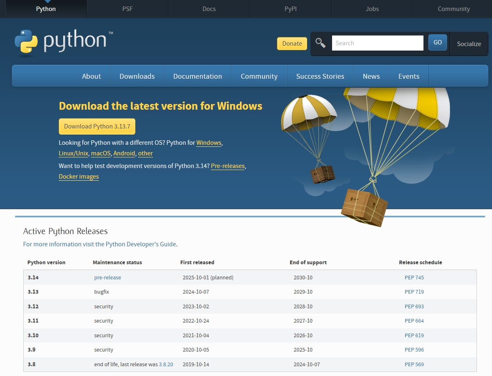  

### Install Python (Default Settings)

  1. Run the installer. During installation, it is recommended to select:  
     - **Add Python to PATH**  
     - Keep the default installation directory  
  2. Click **Install Now** to start the installation.  

- Verify Installed Version (Windows / Linux)

  1. Open the command tool:
      - **Windows** → Command Prompt
      - **Linux** → Terminal
  2. Type the command:
      ```bash
      python --version
      ```

## 3. Install Git
- Git Website: : https://git-scm.com/downloads
  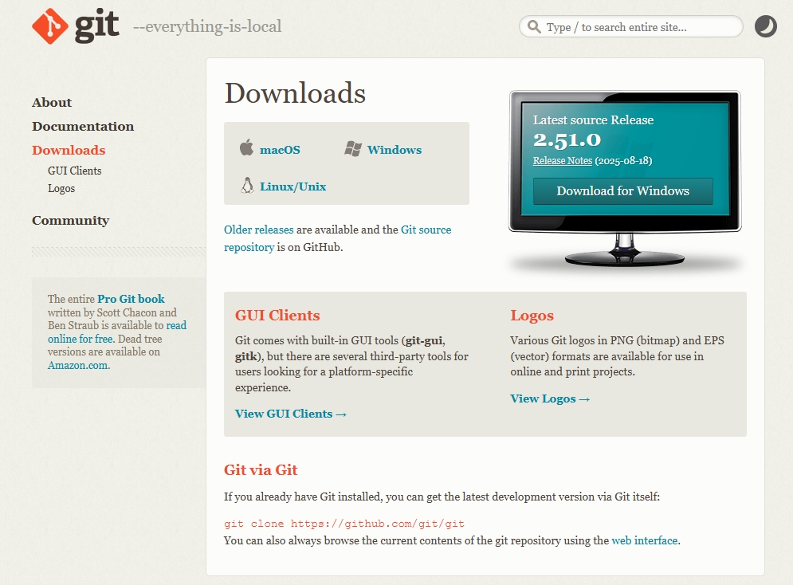  

### Git Installation Instructions

Run the installer. You can keep the default options. Recommended settings:

- **Adjusting your PATH environment**: Choose **Git from the command line and also from 3rd-party software**  
- **Choosing HTTPS transport backend**: Choose **Use the OpenSSL library**  
- Keep other options as default

Click **Install** to start the installation.

- Verify Installed Version (Windows / Linux)

  1. Open the command tool:
      - **Windows** → Command Prompt
      - **Linux** → Terminal
  2. Type the command:
      ```bash
      git --version
      ```
- Clone Rafael-Iot-SDK repository:
  ```sh
  git clone https://github.com/RafaelMicro/Rafael-IoT-SDK.git
  ```

---

## 4. Windows WSL ( Windows Subsystem for Linux）Setup Reference Documents  

- ### [WSL-Setup](../SDK_Setup/sdk-wsl-setup.md) 
  

## 5. Rafael Extension Reference Documents  

- ### [Rafael Extension](../SDK_Setup/sdk_extension.md) 
  **Open SDK folder using VS Code**

<div style="display: flex; align-items: center; gap: 20px;">
  <div style="text-align: center;">
    <p><strong>VS Code File-->Open Folder</strong></p>
   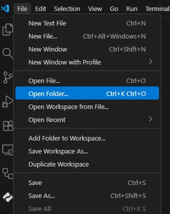  
  </div>
  <div style="text-align: center;">
    <p><strong>Open Rafael-IoT-SDK Foler</strong></p>
      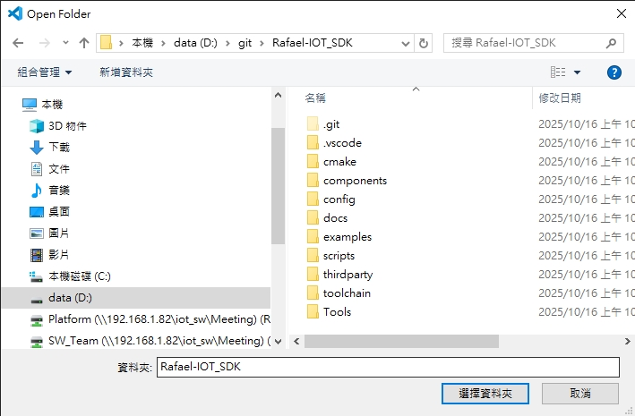
  </div>
</div>

   
  1. Open the command tool:
      - **Windows** → Command Prompt
      - **Linux** → Terminal
  2. Install Rafael VS Code extension:
      ```sh
      code --install-extension tools/rafael_extension/rafael-extension-0.0.2.vsix
      ```
      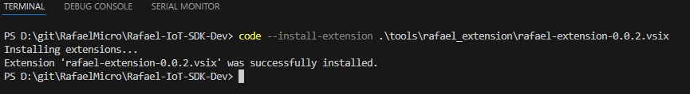   
---

### Rafael Extension 

<div style="display: flex; align-items: center; gap: 20px;">
  <div style="text-align: center;">
    <p><strong>Choose the Rafael Extension Icon</strong></p>
    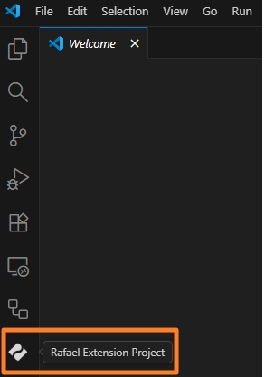
  </div>
  <div style="text-align: center;">
    <p><strong>Open Rafael Extension</strong></p>
     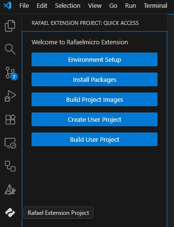
  </div>
</div>


## Rafael Extension: Left-Hand Panel Overview

The left-hand panel of the Rafael Extension provides four main functions:

- **Environment Setup** – Downlad toolchain/cmake/ninja.
- **Install Package** – Install required SDK packages or dependencies.
- **Build Project Image** – Compile and build the selected example or project image.
- **Create User Project** – Generate a new user project based on the selected example and configuration.
- **Build User Project** – Build the user project after configuration and editing.

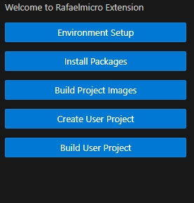


## Environment Setup

### Rafael Extension: Environment Setup

The Environment Setup panel in Rafael Extension ensures that the development environment is complete. 
It provides a button to download and extract any missing tools, including arm-toolchain, CMake, and Ninja, into the appropriate SDK/toolchain directories.

Its main tasks are:

1. **Check for Required Tools**
   - **Toolchain** (compiler)
   - **CMake**
   - **Ninja**

2. **Download Required Tools**
   - Click the button to download and extract the missing tools to the following directories:
     - `toolchain/arm/Windows` for Toolchain (Win System)
     - `toolchain/arm/Linux` for Toolchain (Linux System)
     - `toolchain/cmake/Windows` for CMake (Win System)
     - `toolchain/cmake/Linux` for CMake (Linux System)
     - `toolchain/ninja/Windows` for Ninja (Win System)
     - `toolchain/ninja/Linux` for Ninja (Linux System)

3. **Operation Restriction**
   - All other panel buttons are **locked until the environment check and installation are complete**.
   - **Once the environment check and installation are finished, all buttons will be unlocked.**  

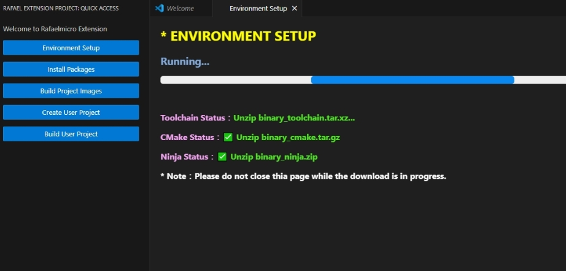

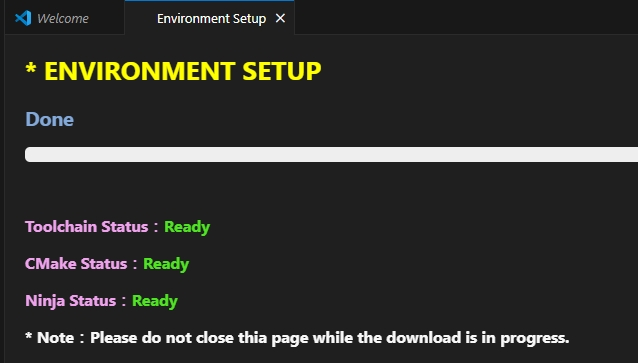


## Install Package

### Rafael Extension: Install Package

The Install Package panel allows you to install the required software packages for the SDK. SDK development requires the VS Code Extension package. You can use the following options:

- **Install Python Package Button** – Install the required Python packages.
- **Install Extension Package Button** – Install the VS Code extension package required for SDK development.

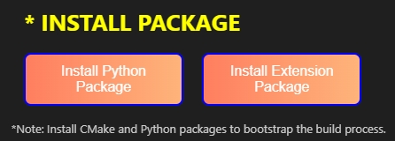

-  Using Rafael Extension in VS Code:
   - Install Python and VS Code extensions Finish
    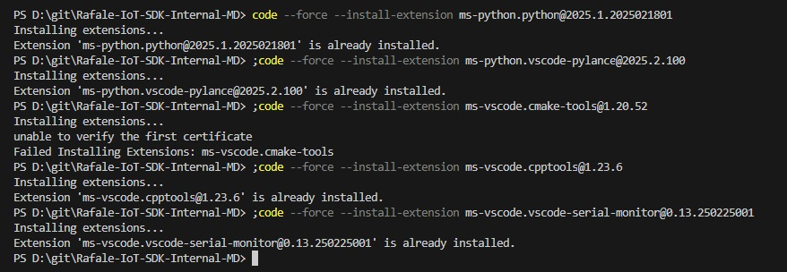  
    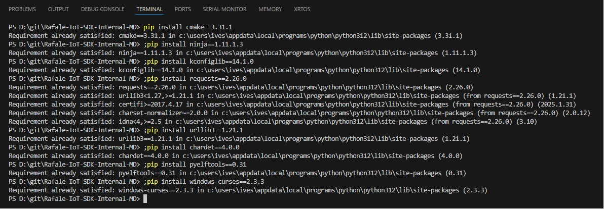  

## Build Project Image

### Rafael Extension : User Space

The User Space panel allows you to configure the following options:

- **Example** – Select an example project.
- **Project Type** – Choose the type of project.
- **Chip Type** – Select the target chip.
- **Board Type** – Choose the target board.

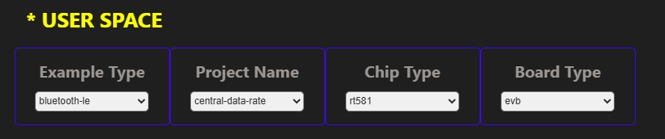

### Rafael Extension: Peripheral Item

The Peripheral panel allows you to configure MCU peripherals for your project.

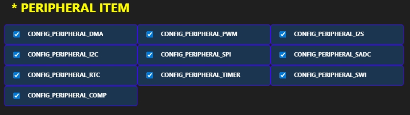

### Rafael Extension: Stdio Support

The Stdio Support panel allows you to configure the MCU's standard I/O UART for your project. You can set the following options:

- **UART Port** – Select the UART instance to use.
- **UART TX** – Select the UART TX pin number.
- **UART RX** – Select the UART RX pin number.
- **UART Baud Rate** – Set the communication speed.
- **Idle Sleep** – Configure the project to not enter sleep mode (N/A for this project).

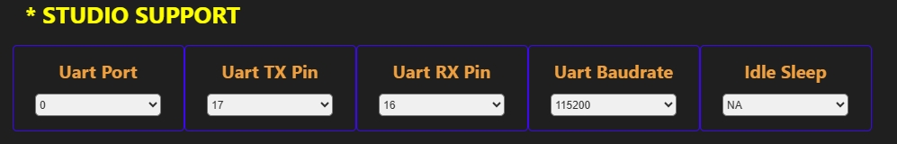

### Rafael Extension: User Build Image

The User Build Image panel allows you to configure and build your project using CMake. You can set the following options:

- **Build Button** – Execute the CMake build process and build modified files.  
- **Rebuild Button** – Execute the CMake build process with a clean build of all files.  
  
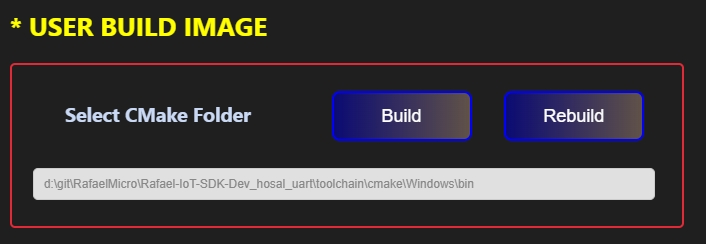

### Rafael Extension: Flash Tool

The Flash Tool panel allows you to select the programming/debugging tool for flashing firmware to your target device. Currently, it supports **OpenOCD** and **JLink**.

- **Flash Tool** – Choose the flashing tool: OpenOCD or JLink.
- **Target Name** – When **JLink** is selected as the Flash Tool, you must select the target chip to ensure proper flashing.

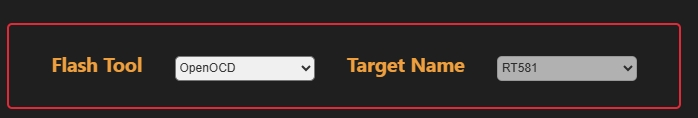

### Rafael Extension: Flash Programe

The Flash Program panel allows you to erase and program the MCU flash. You can use the following options:

- **Chip Erase Button** – Erase the entire chip.
- **Sector Erase Button** – Erase user-specified sectors (4K)

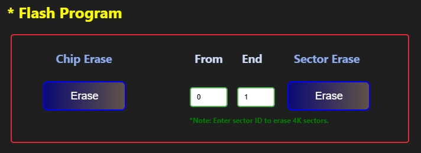


### Rafael Extension: User Download Image

The User Download Image panel allows you to program the MCU flash with a binary file. You can use the following options:

- **Address** – Set the flash programming start address.
- **Select Button** – Select the binary file to program.
- **Download Button** – Start programming the selected file.
  
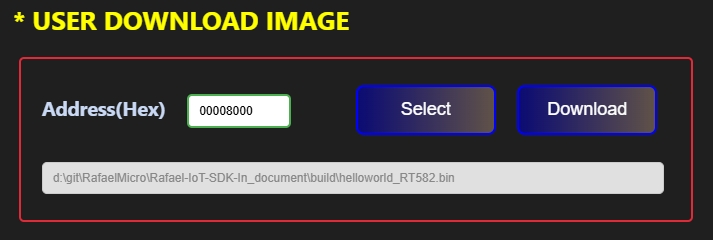

> **Note:**  
> - Bootloader start addresses:  
>   - RT581 / RT582 / RT583: `0x00000000`  
>   - RT584: `0x10000000`
> 
> - Application start addresses:  
>   - RT581 / RT582 / RT583: `0x00008000`  
>   - RT584: `0x10010000`  

## Create User Project

### Rafael Extension: Create Project

The Create Project panel allows you to create a new SDK project. You can use the following options:

- **Create Project Select** – Choose how to create the project:
  - Create a new template project
  - Create a project from an existing project
- **Project Name** – Set the name of the project.
- **Select** – Select the project template.
- **Create** – Generate the project in the user folder.
-   
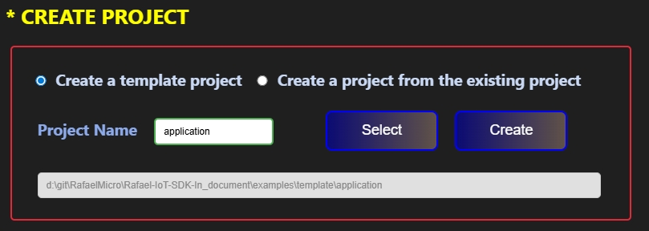

> **Note:**  
> - When creating a project from an existing project, you need to select a default config file:  
>   - `default-rt581-evb.config`  
>   - `default-rt582-evb.config`  
>   - `default-rt583-evb.config`  
>   - `default-rf1301-evb.config`  
>   - `default-rt584h-evb.config`  
>   - `default-rt584l-evb.config`  

### Rafael Extension: User Build Image

The User Build Image panel allows you to configure and build your project using CMake. You can use the following options:

- **Config** – Select the chip configuration for the project.
- **Select Button** – Select the path to the CMake executable.
- **Build Button** – Run the CMake build process.

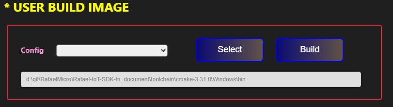

### Rafael Extension: Menu Config

The Menu Config panel allows you to modify the project configuration. You can use the following option:

- **Config Button** – Open the menu to modify the project configuration.


### Rafael Extension: ISP Tool (Windows Only)

The ISP Tool panel allows you to launch the ISP utility for programming. You can use the following option:

- **Execute Button** – Open the ISP tool.


## Build User Project

> **Note:**  
>    Build User Project is mainly used for building projects created by the user.  
    The build process is the same as Build Project Images.  
    This allows you to compile and generate binaries for your own projects just like building example project images. 


### Rafael Extension : User Space
The User Space panel allows you to configure the following options:

- **Example** – Select an example project.
- **Project Type** – Choose the type of project.
- **Chip Type** – Select the target chip.
- **Board Type** – Choose the target board.


### Rafael Extension: Peripheral Item

The Peripheral panel allows you to configure MCU peripherals for your project.


### Rafael Extension: Stdio Support

The Stdio Support panel allows you to configure the MCU's standard I/O UART for your project. You can set the following options:

- **UART Port** – Select the UART instance to use.
- **UART TX** – Select the UART TX pin number.
- **UART RX** – Select the UART RX pin number.
- **UART Baud Rate** – Set the communication speed.
- **Idle Sleep** – Configure the project to not enter sleep mode (N/A for this project).


### Rafael Extension: User Build Image

The User Build Image panel allows you to configure and build your project using CMake. You can set the following options:

- **Select Button** – Select the CMake executable path.  
- **Build Button** – Execute the CMake build process and build modified files.  
- **Rebuild Button** – Execute the CMake build process with a clean build of all files.  


### Rafael Extension: Flash Programe

The Flash Program panel allows you to erase and program the MCU flash. You can use the following options:

- **Chip Erase Button** – Erase the entire chip.
- **Sector Erase Button** – Erase user-specified sectors (4K)


### Rafael Extension: User Download Image

The User Download Image panel allows you to program the MCU flash with a binary file. You can use the following options:

- **Address** – Set the flash programming start address.
- **Select Button** – Select the binary file to program.
- **Download Button** – Start programming the selected file.
  


> **Note:**  
> - Bootloader start addresses:  
>   - RT581 / RT582 / RT583: `0x00000000`  
>   - RT584: `0x10000000`
> 
> - Application start addresses:  
>   - RT581 / RT582 / RT583: `0x00008000`  
>   - RT584: `0x10010000`  

# Rafael SDK Debug
### 

## 1. VS Code Debug Mode
- Choose the VS Code Debug Icon  
  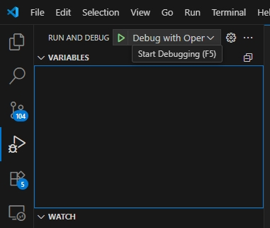  
- Enter Debug Mode Succes  
  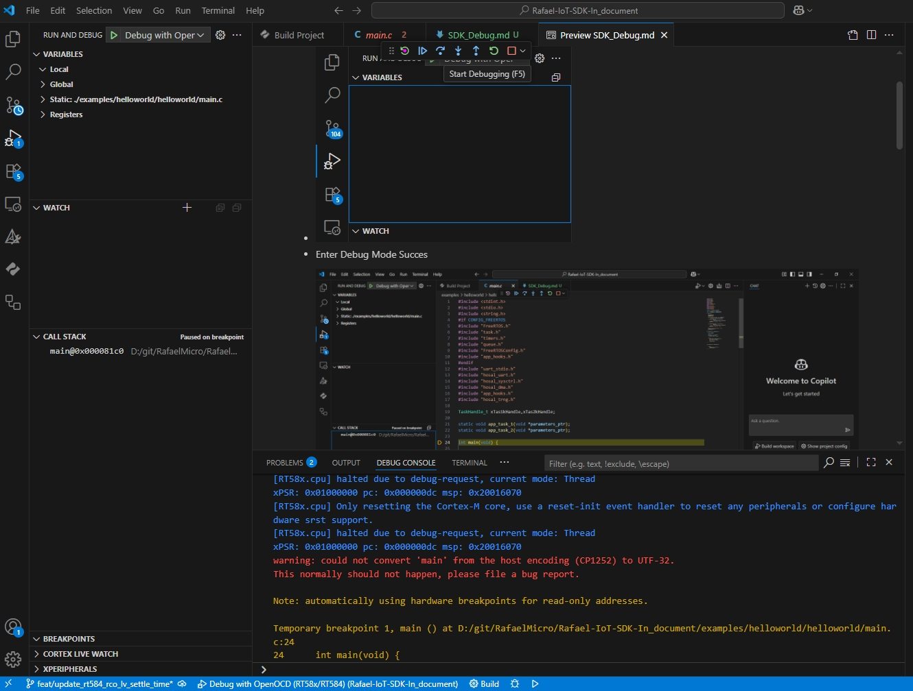
  
## 2. VS Code Debug Tool Bar

- 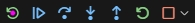
        
  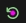**Reset Device**    : 	Reset program execution
    
   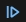  **Continue**        :	Continue program execution  
     - Shortcuts : F5  
  
  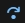  **Step Over**       : Skip the current function and move to the next line  
     - Shortcuts : F10 

  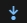  **Step Into**       : 	Step into the function for line-by-line execution  
     - Shortcuts : F11 

  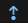  **Step Out**        : Step out of the current function   
     - Shortcuts : Shift+F11

  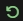  **Restart**         : Restart the debugging session   
     - Shortcuts : Ctrl+Shift+F5

  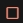  **Stop**            : Sotp Debug  
     - Shortcuts : Shift+F5

## 3. VS Code Debug Panels

  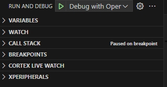  

- **Variables Panel**  
  Shows current variable values in scope. Inspect or modify them during runtime.  
      - 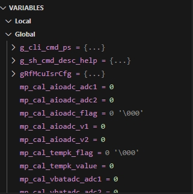  

- **Watch Panel**  
  Track specific variables or expressions continuously.  
      -  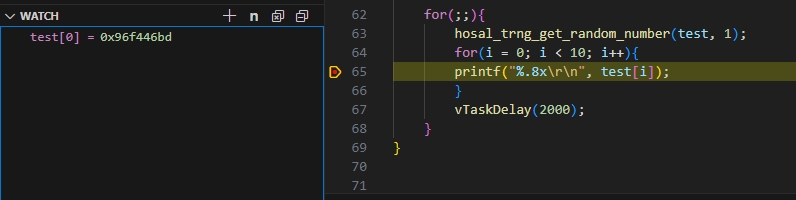

- **Call Stack Panel**  
  Displays the sequence of active function calls.  
      -  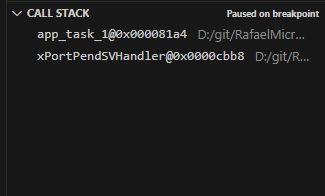  


- **Breakpoints Panel**  
  Lists and manages all active breakpoints.
      -  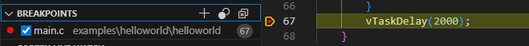  
  
- **XPeripherals Panel**  
  Lists and manages all active breakpoints.  
      -  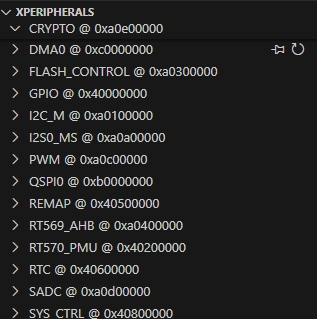  

- **Debug Console**  
  Interactive console for commands and program output.  
      -  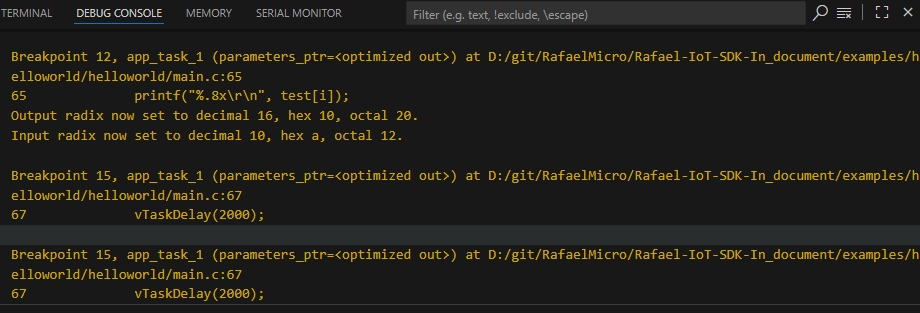
  
- **Memory View**  
Displays memory contents at selected addresses. Requires **Memory View** extension: `mcu-debug.memory-view`.  
      -  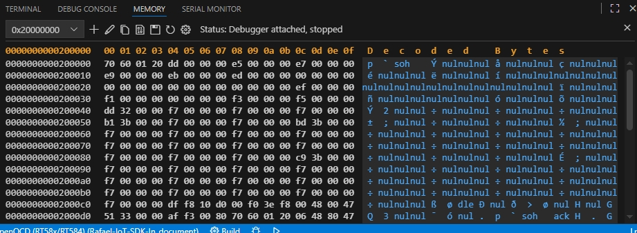
  
- **Serial Monitor**  
  View and send data through serial ports. Requires **Serial Monitor** extension: `ms-vscode.vscode-serial-monitor`.
      -  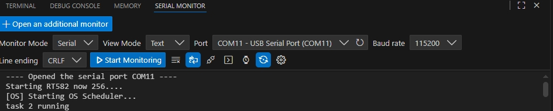
  

---
### Manual Operation
---
####  Install Requriemtn Tool (extensions.txt/requirements.txt)
- File path: `SDK\tools\requirements.txt`
- Open terminal and navigate:
  cd SDK\tools\requriement
- Install using pip:
  ```sh
  pip install -r requirements.txt
  ```
- Install rafael extension:
  ```sh
  code --install-extension rafael-extension-0.0.2.vsix
  ```
- Install using Python script:
  ```sh
  Python extensions.py
  ```


####  Toolchain Install Reference Documents  

Toolchain Setup

This directory contains the toolchains and build tools required for compiling ARM projects.  
The following provides installation instructions, recommended versions, and licensing information.

---

####  Usage Instructions

1. Download the appropriate toolchain and build tools for your platform.
2. Unzip the files to the specified directories.
3. Add the `bin` directory to your system's PATH, so the tools can be used from the terminal or command prompt.
4. **Linux users note**: After unzipping, use `chmod +x` to set executable permissions.
5. Verify the installation:
   ```bash
   arm-none-eabi-gcc --version
   cmake --version
   ninja --version
   ```
####  ARM GNU Toolchain
---
- **Source**: [Arm GNU Toolchain Downloads](https://developer.arm.com/downloads/-/arm-gnu-toolchain-downloads)  
- **Description**:  
  The `arm` folder contains official precompiled binaries of the Arm GNU Toolchain for multiple platforms. No modifications have been made.  
- **License & Attribution**:  
  Arm GNU Toolchain is based on open-source licenses ([GPL](https://www.gnu.org/licenses/gpl-3.0.en.html), [LGPL](https://www.gnu.org/licenses/lgpl-3.0.en.html), etc.).  
  For more information, visit the [official Arm GNU Toolchain page](https://developer.arm.com/Tools%20and%20Software/GNU%20Toolchain).  

**Downlaod toolchain**:

  - **Linux**: [14.2.rel1](https://developer.arm.com/-/media/Files/downloads/gnu/14.2.rel1/binrel/arm-gnu-toolchain-14.2.rel1-x86_64-arm-none-eabi.tar.xz)  
    Unzip to path: `toolchain/arm/Linux/`  
    **Set environment variable**:  
    ```bash
    export PATH=$PATH:$(pwd)/toolchain/arm/Linux/bin
    ```
    **Set executable permission**:  
    ```bash
    chmod +x toolchain/arm/Linux/bin/*
    ```

  - **Windows**: [14.2.rel1](https://developer.arm.com/-/media/Files/downloads/gnu/14.2.rel1/binrel/arm-gnu-toolchain-14.2.rel1-mingw-w64-x86_64-arm-none-eabi.zip)  
    Unzip to path: `toolchain/arm/Windows/`  
    **Set environment variable**:  
    ```powershell
    setx PATH "%PATH%;%CD%\toolchain\arm\Windows\bin"
    ```
---

---
####  CMake

- **Source**: [CMake Downloads](https://cmake.org/download/)  
- **Description**:  
  CMake is a cross-platform build system generator, used to produce Makefiles or Ninja build scripts.  
- **License & Attribution**:  
  CMake is released under the [BSD 3-Clause License](https://cmake.org/licensing/), allowing free use, modification, and redistribution.  
  More information at [CMake official page](https://cmake.org/).  

**Download cmake**:  
    
  - **Linux**: [v3.30.4](https://cmake.org/files/v3.24/cmake-3.24.0-linux-x86_64.sh)  
    Unzip to path: `toolchain/cmake/Linux/`  
    ```bash
    export PATH=$PATH:$(pwd)/toolchain/cmake/Linux/bin
    chmod +x toolchain/cmake/Linux/bin/*
    ```

  - **Windows**: [v3.30.4](https://cmake.org/files/v3.24/cmake-3.24.0-windows-x86_64.zip)  
    Unzip to path: `toolchain/cmake/Windows/`  
    ```powershell
    setx PATH "%PATH%;%CD%\toolchain\cmake\Windows\bin"
    ```
---

####  Ninja

- **Source**: [Ninja Releases](https://github.com/ninja-build/ninja/releases)  
- **Description**:  
  Ninja is a small, fast build system focused on speed, often used with CMake (`-G Ninja`).  
- **License & Attribution**:  
  Ninja is released under the [Apache License 2.0](https://www.apache.org/licenses/LICENSE-2.0), allowing free use and redistribution.  
  More information at [Ninja GitHub page](https://github.com/ninja-build/ninja).  


**Download ninja**: 

  - **Linux**: [v1.11.1](https://github.com/ninja-build/ninja/releases/download/v1.11.1/ninja-linux.zip)  
    Unzip to path: `toolchain/ninja/Linux/`  
    ```bash
    export PATH=$PATH:$(pwd)/toolchain/ninja/Linux
    chmod +x toolchain/ninja/Linux/*
    ```

  - **Windows**: [v1.11.1](https://github.com/ninja-build/ninja/releases/download/v1.11.1/ninja-win.zip)  
    Unzip to path: `toolchain/ninja/Windows/`  
    ```powershell
    setx PATH "%PATH%;%CD%\toolchain\ninja\Windows"
    ```
---

####  Check Toolchain, CMake, and Python Environment Variables
- Ensure `PATH` variable includes the Toolchain `bin\`directory
- Add `TOOLCHAIN_PATH` environment variable pointing to the GCC Toolchain directory
- Check Python paths:
     - C:\Users\user\AppData\Local\Programs\Python\Python312\Scripts\
     - C:\Users\user\AppData\Local\Programs\Python\Python312\
        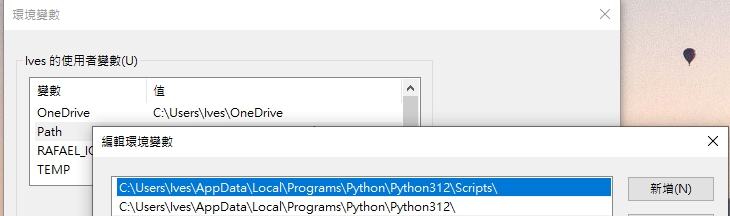 


#### J-Link Setup Reference Documents
- ### [J-Link Setup](../SDK_Setup/sdk-setup-jlink.md) 