# Windows WSL（Windows Subsystem for Linux）

## Windows version requirements :  
  - Windows 10 version 2004 (Build 19041) or later
  - Windows 11  
  
#### Open Command Prompt Using the Run Dialog

---
   - Press Win + R on your keyboard. 
        → This opens the Run dialog box.
   - Type cmd in the text field.
   - Press Enter or click OK.
        → The Command Prompt window will open. 
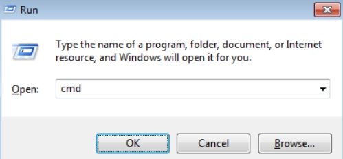 
---  

#### Check WSL

---
   - **wsl --version**   
---  
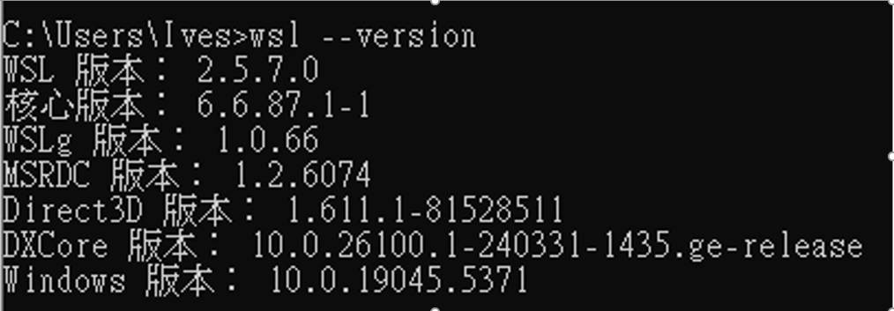 

## Windows Command Line Install :

---
### List available distributions: 
   - **wsl --list --online**  
  
---  

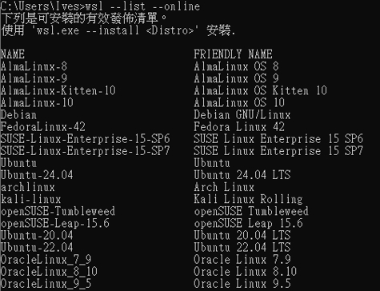 

---
### Install Linux: 
   - **wsl --install buntu**
---  

 

---
### Open VS Code : 
   - Press Extension Icon
   - Search WSL extension
   - Install WSL
---  

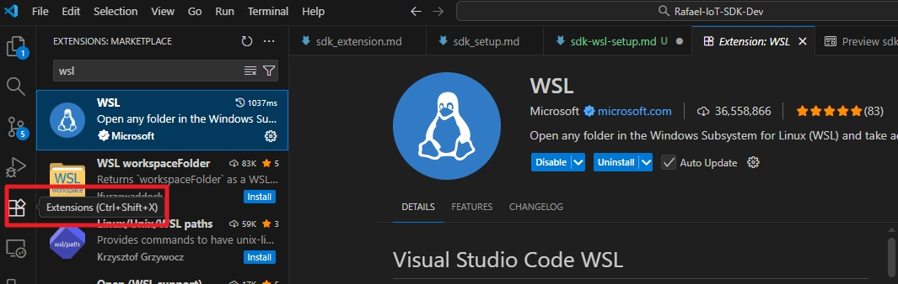 

---
### Remote Exploer : 

---  
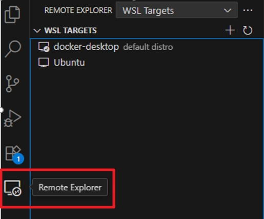 

---

### Connect WSL : 
   - Press Ctrl+Shiht+P 
   - Select **WSL : Open Folder in WSL**
   - Open **SDK Folder**
---  

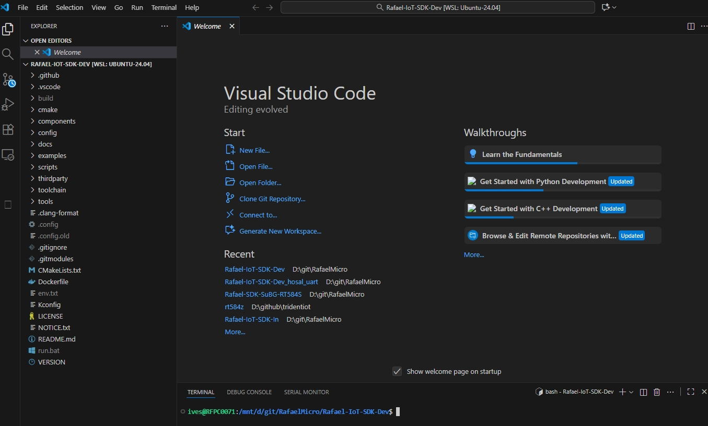 

---

### Install Rafael Extension : 

---
      code --install-extension tools/rafael_extension/rafael-extension-0.0.2.vsix
 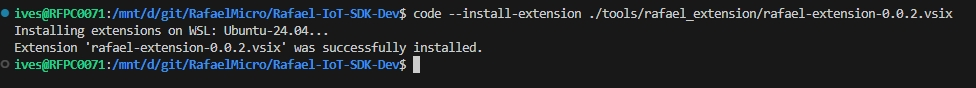

---  

---
     Run apt update whenever an error message occurs.
 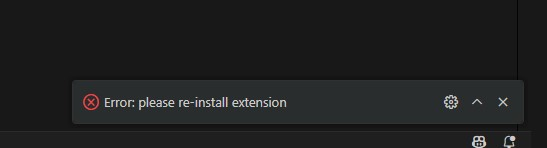

---  

## Install Tool in Ubuntu Environment : 

---
  - **sudo apt update**  
 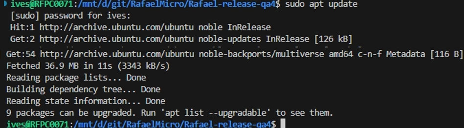

---  

---
  - **sudo apt install -y python3 python3-pip**  
 

---  

---
  - **sudo apt update**  
  - **sudo apt install -y snapd**  
  - **sudo snap install powershell --classic**  
  
 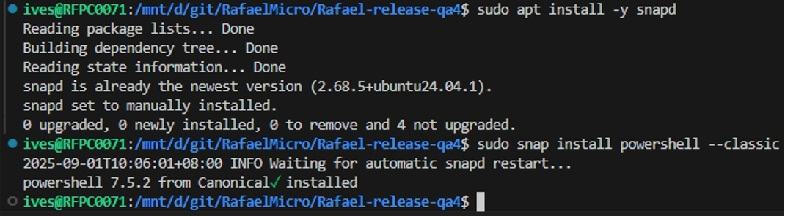

---

---
  - **sudo apt update**  
  - **sudo apt install python3-tk**  
  - **sudo apt install python3-kconfiglib**  
  
   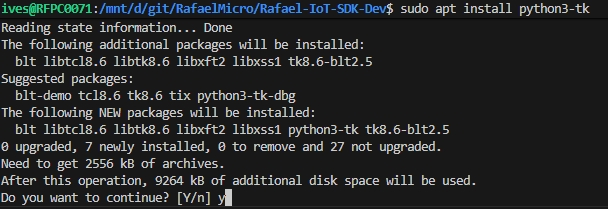

   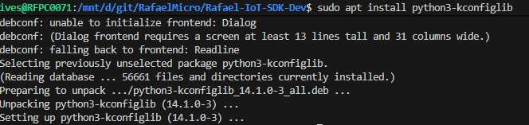
---

## Start Rafael Extension :  

  - [Rafael Extension Operation](../SDK_Setup/sdk_extension.md) 

