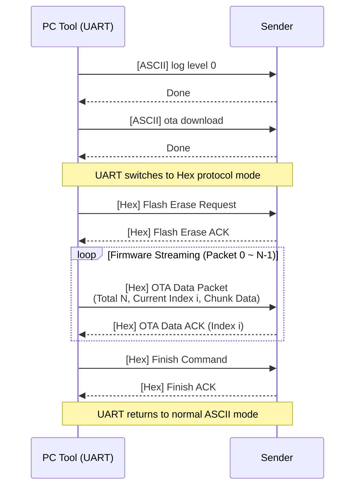
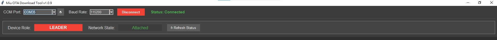
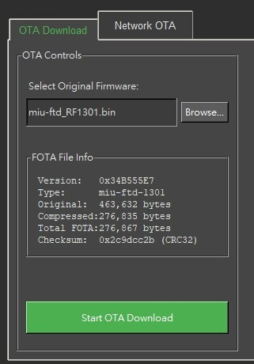
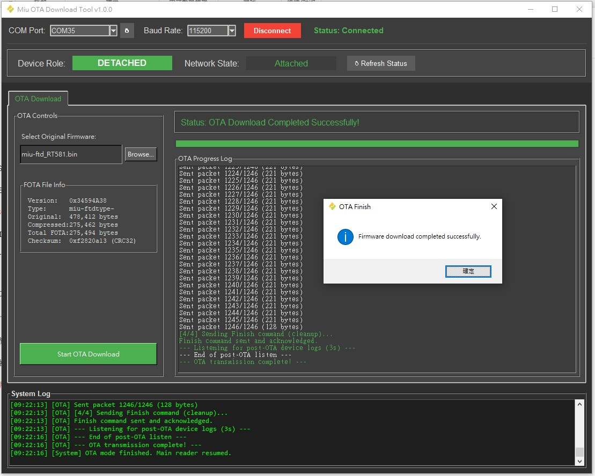
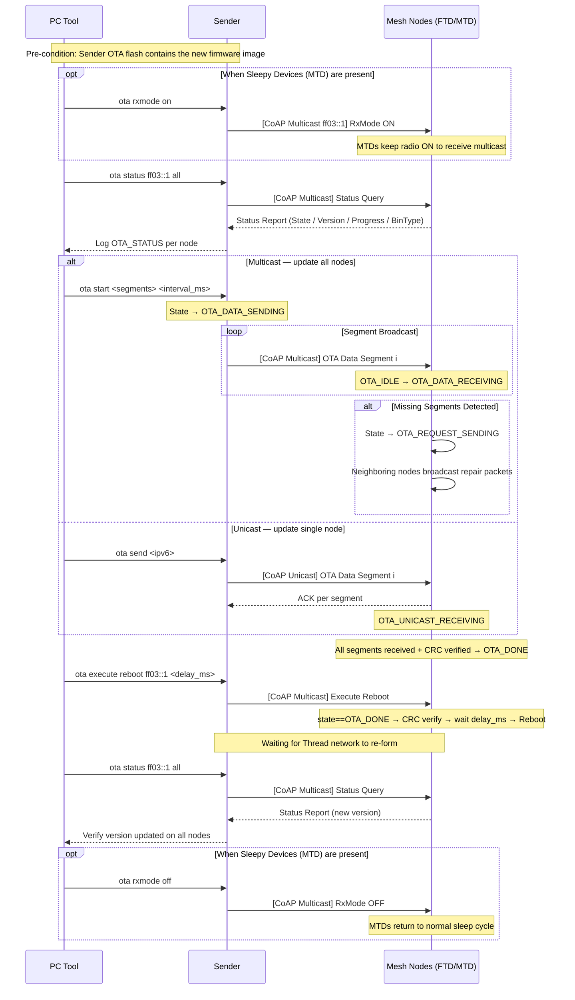
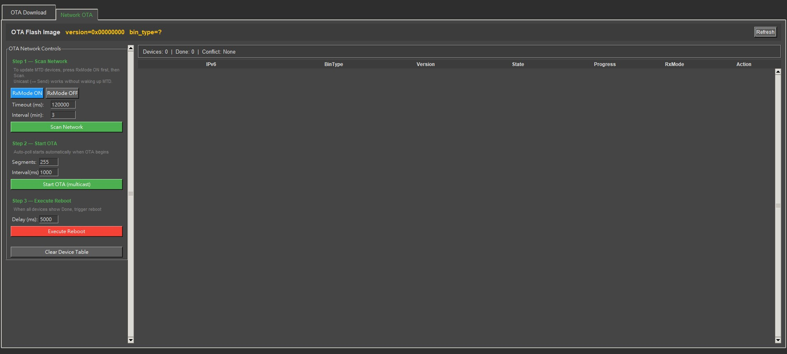

# Thread Over-The-Air (OTA) Update Guide

This document covers the complete firmware update process for Rafael MIU Thread devices. The update flow consists of two distinct phases:

- **Phase 1 — UART Download:** Transfer the new firmware image from the PC Tool to the Sender node's OTA flash over UART.
- **Phase 2 — Network OTA:** The Sender distributes the firmware to all mesh nodes over the Thread network, then triggers a synchronized reboot.


---

## 1. Software Configuration

To use OTA features, ensure the following macro is set in your `CMakeLists.txt` before building:

```cmake
set(CONFIG_APP_TASK_OTA_ENABLE 1)
```

This enables the internal OTA service task, background flash management, and the network recovery state machine.

---

## 2. Phase 1 — UART Firmware Download (PC Tool → Sender)

In this phase, the PC Tool transfers a FOTA image to the Sender node's OTA flash partition via UART. The tool handles all protocol switching automatically — no manual CLI input is needed during the transfer.

### 2.1 Protocol Flow



### 2.2 Tool Operation

**Step 1: Connection**

1. Connect the Sender node via UART.
2. Open the **Rafael OTA Tool** and go to the **OTA Download** tab.
3. Select your **COM Port** and **Baud Rate**:
   - `115200` — standard, compatible with all setups.
   - `2000000` — high speed (recommended, ~25 seconds per transfer). Requires UART0 IRQ priority = 3 (enabled by default).
4. Click **Connect**.



*Figure 1: Serial port configuration*

**Step 2: Firmware Selection**

1. Click **Load File** and select the compiled binary (`miu-ftd.bin`, `miu-mtd.bin`, etc.).
2. The tool automatically extracts the firmware version and bin_type from the binary, compresses it with LZMA, and prepends a FOTA header.



*Figure 2: Selecting the firmware binary*

**Step 3: Start Download**

1. Click **Start OTA Download**. The tool silences device logs, triggers `ota download` mode, erases the OTA flash, and streams all packets automatically.
2. Wait for the progress bar to reach 100%.



*Figure 3: Download in progress*

**Step 4: Verification**

Once complete, use the `ota` CLI command on the Sender to confirm the image is stored correctly:

```
> ota
ota state     : Done
ota image version  : 0x34594a38
ota image bin type : miu-ftd-1301
ota image size     : 0x00043426
ota image crc      : 0xf2820a13
current bin version: 0x335b5b32
```

---

## 3. Phase 2 — Network OTA (Sender → Mesh Nodes)

In this phase, the Sender broadcasts the firmware from its OTA flash to all nodes in the Thread mesh using UDP multicast. After all nodes have received the image, a synchronized reboot command updates the entire network at once.

### 3.1 OTA State Machine

Each node runs a state machine to track its progress through the update:

| State | Description |
| :--- | :--- |
| `OTA_IDLE` | Standby. Waiting for OTA to begin. |
| `OTA_DATA_RECEIVING` | Receiving multicast firmware segments. |
| `OTA_UNICAST_RECEIVING` | Receiving unicast segments; acknowledges each packet directly. |
| `OTA_REQUEST_SENDING` | **Recovery mode.** Missing segments detected — node broadcasts a repair request. Neighboring nodes with the data respond automatically. |
| `OTA_DATA_SENDING` | This node (Sender/FTD) is actively sending firmware. |
| `OTA_DONE` | All segments received and CRC verified. Waiting for reboot command. |
| `OTA_REBOOT` | Reboot countdown in progress. |

> Nodes do **not** reboot automatically upon reaching `OTA_DONE`. A manual `ota execute reboot` is required to synchronize the reboot across the network, preventing early reboots from disrupting routing paths for nodes still recovering.

### 3.2 Protocol Flow



### 3.3 Tool Operation

Open the **Network OTA** tab in the MiuOTADownload Tool and connect to the Sender node.



*Figure 4: Network OTA tab — step-by-step controls (left), live device table (right)*

**Pre-condition: Upload Firmware to Sender**

Complete Phase 1 (Section 2) first. The **OTA Flash Image** bar at the top of the Network OTA tab displays the version and bin_type currently stored in the Sender's OTA flash. Click **Refresh** to re-read at any time.

---

**Step 1 — Scan Network**

1. *(MTD only)* Click **RxMode ON** to force Sleepy End Devices to keep their radios on so they appear in the scan.
   > Unicast updates (→ Send) do **not** require RxMode ON — only multicast scan does.
2. Set **Timeout (ms)** (default: `120000`) and **Interval (min)** (default: `3`).
3. Click **Scan Network**. The tool sends `ota status ff03::1 all` and repeats automatically at the configured interval. The button toggles to **Stop Scan** while active.

Each responding node appears as a row in the device table:

| Column | Description |
| :--- | :--- |
| **IPv6** | Last 4 groups of the node's mesh-local address |
| **BinType** | Firmware type currently running on the node |
| **Version** | Current firmware version |
| **State** | OTA state (`Idle`, `Receiving`, `Done`, etc.) |
| **Progress** | Download completion percentage |
| **RxMode** | Radio forced on (`1`) or normal sleep (`0`) |
| **Action** | **→ Send** button for unicast update (see below) |

The **summary bar** shows total **Devices** and **Done** count. A **⚠ CONFLICT** warning appears if multiple firmware versions are detected simultaneously. If no MTD devices appear after scanning, a hint bar prompts you to enable RxMode ON and scan again.

---

**Step 2 — Start OTA**

Set the parameters and click **Start OTA (multicast)**:
- **Segments** — chunks per burst (default: `255`)
- **Interval (ms)** — delay between packets (default: `1000`)

Clicking **Start OTA** automatically starts the scan loop so the device table updates in real time. The button toggles to **Stop OTA** while active. All **→ Send** buttons are disabled during multicast to prevent conflicts.

> If the summary bar shows **⚠ CONFLICT**, stop the session with **Stop OTA** and restart from this step.

---

**Step 3 — Execute Reboot**

Once **Done = N/N**:
1. Set **Delay (ms)** — how long each node waits before rebooting (default: `5000`).
2. Click **Execute Reboot**.

The tool sends `ota execute reboot ff03::1 <delay_ms>`. All nodes in `OTA_DONE` state verify the CRC and reboot after the delay.

> After reboot, the Thread network may take up to 20 minutes to fully re-form. This is expected behavior.

After the network re-forms, click **Scan Network** to verify all nodes report the new firmware version. Then click **RxMode OFF** to restore normal MTD sleep behavior.

---

**Unicast Retry (Optional)**

If a single node fails to complete the multicast update, click its **→ Send** button in the device table to send the firmware directly via unicast. Unicast can be used regardless of the node's RxMode state. Stop any active multicast session first — the **→ Send** buttons are disabled while multicast OTA is running. The button toggles to **■ Stop** during an active unicast transfer.

---

**Clear Device Table**

The **Clear Device Table** button removes all rows and resets the summary counters. Use this to start a fresh monitoring session after a reboot.

---

## 4. CLI Command Reference

| Command | Description |
| :--- | :--- |
| `ota` | Print OTA flash image info and current state. |
| `ota erase` | Manually erase the OTA flash partition. |
| `ota download` | Enter UART binary download mode (triggered automatically by the Tool). |
| `ota start <segments> <interval_ms>` | Start multicast OTA broadcast. |
| `ota send <ipv6>` | Unicast OTA to a single node. |
| `ota stop` | Abort the current multicast or unicast session. |
| `ota rxmode <on/off>` | Force MTD radio on or restore normal sleep. |
| `ota status <ipv6> <ftd/mtd/all> <timeout_ms>` | Query OTA state of matching nodes. Each replies with `OTA_STATUS\|<ipv6>\|<version>\|<state>\|<rxmode>\|<progress%>\|<bin_type>`. |
| `ota self` | Print this node's own OTA status. |
| `ota execute reboot <ipv6> <time_ms>` | Trigger synchronized reboot across the network. |
| `ota debug <level>` | Set OTA debug log verbosity. |

---

## 5. Protocol Reference

### 5.1 UART Binary Protocol (Phase 1)

All packets use the following frame structure. All multi-byte fields are **little-endian** unless noted.

| Field | Size | Description |
| :--- | :--- | :--- |
| Preamble | 4 bytes | `FF FC FC FF` (fixed) |
| Length | 1 byte | Byte count from Cmd ID to end of Payload (excludes Preamble and Checksum) |
| Cmd ID | 4 bytes | Command identifier |
| Address | 2 bytes | `00 00` (host → device) |
| Mode | 1 byte | `00` |
| Payload | N bytes | Command-specific data |
| Checksum | 1 byte | One's complement of the sum of all bytes from Length to end of Payload |

**Flash Erase Request**
```
FF FC FC FF  07  00 00 00 F0  00 00  00  08
```

**Flash Erase ACK**
```
FF FC FC FF  0B  00 80 00 F0  00 00  00  00 00 00 00  84
```

**OTA Data Packet** — sent once per chunk (max 221 bytes of data):

| Field | Size | Value |
| :--- | :--- | :--- |
| Preamble | 4 B | `FF FC FC FF` |
| Length | 1 B | 7 + payload length |
| Cmd ID | 4 B | `01 00 00 F0` |
| Address | 2 B | `00 00` |
| Mode | 1 B | `00` |
| file_type | 2 B | `01 00` (fixed) |
| manufacturer_code | 2 B | `34 12` (fixed) |
| file_version | 4 B | Firmware version from FOTA header |
| file_size | 4 B | Total FOTA image size in bytes |
| total_packets | 4 B | Total packet count (N) |
| current_index | 4 B | This packet's index (0-based) |
| data_length | 2 B | Bytes of data in this packet |
| data | ≤221 B | FOTA image chunk |
| Checksum | 1 B | One's complement checksum |

**OTA Data ACK**
```
FF FC FC FF  0B  00 80 00 F0  00 00  00  [current_index: 4B LE]  [checksum]
```

**Finish Command**
```
FF FC FC FF  07  02 00 00 F0  00 00  00  06
```

**Finish ACK**
```
FF FC FC FF  0B  00 80 00 F0  00 00  00  00 00 00 00  84
```

**NACK (Device Error)**
```
FF FC FC FF  0B  00 90 00 F0  00 00  00  [status: 4B]  [checksum]
```

### 5.2 FOTA Image Format

Before transmission, the PC Tool generates a FOTA image from the raw firmware binary:

| Field | Size | Description |
| :--- | :--- | :--- |
| version | 4 bytes | Firmware version (extracted from `VerGet` marker in binary) |
| bin_type | 12 bytes | Firmware type string, e.g. `miu-ftd-1301` |
| crc32 | 4 bytes | CRC32 of the compressed payload (big-endian) |
| start_address | 4 bytes | `00 00 00 00` (reserved) |
| end_address | 4 bytes | Compressed payload size in bytes (big-endian) |
| reserved | 4 bytes | `00 00 00 00` |
| payload | N bytes | LZMA-compressed firmware (FORMAT_ALONE, dict=64KB, lc=3, lp=0, pb=2) |
