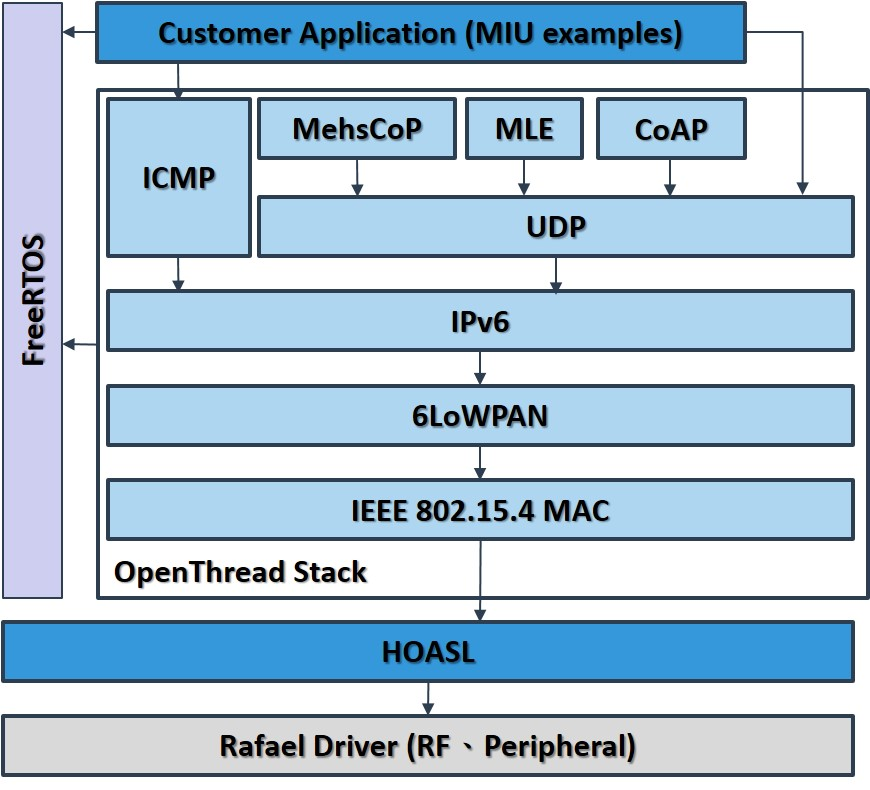

# Mesh It Up (MIU) SDK Overview

This document provides a high-level overview of the **Mesh It Up (MIU) SDK**, covering its core features, underlying architecture, and the unique Sub-GHz networking characteristics supported by MIU.

---

## 1. Core Features and Objectives

**Mesh It Up (MIU)** is a development SDK based on **[OpenThread](https://openthread.io/guides/thread-primer) over Sub-GHz**, designed to help developers quickly build long-range, low-power, and **multi-hop mesh networking** solutions.

### Key MIU Technological Highlights:

* **Long-Range Sub-GHz Support:** Supports global Sub-GHz frequency bands (e.g., **433, 470, 868, 915 MHz**), delivering superior coverage and range.
* **Flexible Data Rates:** Supports multiple data rates (**50, 100, 150, 200, 250, 300 kbps**), allowing for optimal balance between performance and range.
* **Over-the-Air (OTA) Updates:** Provides a self-developed **OTA** solution to enable seamless remote firmware updates for deployed products.

MIU is the ideal choice for applications like smart metering, Industrial IoT (IIoT), and other scenarios requiring **long-range, reliable mesh networking**.

---

## 2. In-Depth SDK Architecture and Components

The MIU SDK follows a strict modular structure, clearly divided into the **Components Layer** and the **Application Examples Layer**.

### Figure 1: MIU SDK Layered Architecture

### 2.1 Core Components Layer

Located within `components/network/mesh-it-up/`, these components form the **core implementation and infrastructure** of the MIU networking functionality:

| Component Name | Description and Core Function |
| :--- | :--- |
| **`miu-openthread`** | **The core implementation of the OpenThread protocol stack.** Contains all standard Thread networking logic and APIs. |
| **`HOSAL Abstraction Layer`** | **Hardware/Operating System Abstraction Layer (HOSAL).** Enables application logic to be quickly ported and switched across different **RT58x series ICs**, simplifying cross-platform compatibility. |
| **`miu-port`** | **Platform Interface Layer (Bridge).** Acts as a crucial bridge, connecting the OpenThread core directly to the underlying HOSAL abstraction layer, and managing interfaces for RF, timers, and other low-level drivers. |

### 2.2 Application Examples Layer

Located within `examples/sub-g/mesh-it-up/`, these provide pre-compiled applications demonstrating how to use the core components:

| Device Name | Thread Type | Description | Corresponding Document |
| :--- | :--- | :--- | :--- |
| **`miu-ftd`** | FTD (Router) | **Full Thread Device.** Always-on node that can act as a Leader or Router, forming the network backbone. | [`miu-ftd-guide.md`](example/miu-ftd-guide.md) |
| **`miu-mtd`** | MTD (Child) | **Minimal Thread Device.** A low-power node that relies on a parent router and periodically wakes up to send or receive data. | [`miu-mtd-guide.md`](example/miu-mtd-guide.md) |
| **`miu-sniffer`** | RCP / Sniffer | Radio Co-Processor (RCP). Specifically used to **capture and analyze** over-the-air Sub-GHz network packets for diagnostics. | [`miu-sniffer-guide.md`](example/miu-sniffer-guide.md)|

---

## 3. Related Resources and Next Steps

### Further Reading (Document links are within the `docs/SubG/mesh-it-up/` folder)

* [`Quick-start.md`](Quick-start.md): Step-by-step guide on setting up the development environment, building, and running your first MIU example.
* **Example Guides:** [`miu-ftd-guide.md`](example/miu-ftd-guide.md), [`miu-mtd-guide.md`](example/miu-mtd-guide.md), [`miu-sniffer-guide.md`](example/miu-sniffer-guide.md)
* **OTA Guides:** [`OTA-guide.md`](OTA-guide.md) : OTA Design and Operation Instructions.

### External Resources

* [OpenThread Official Documentation](https://openthread.io/)
* [OpenThread GitHub Repository](https://github.com/openthread/openthread)