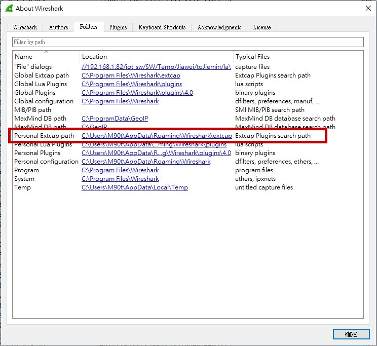
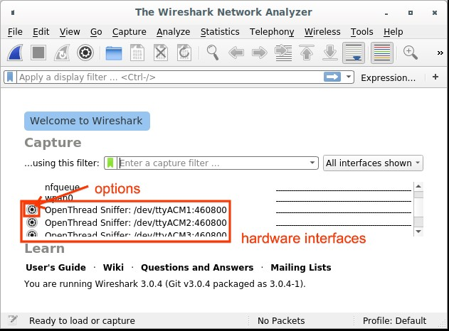
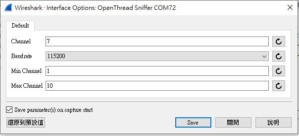
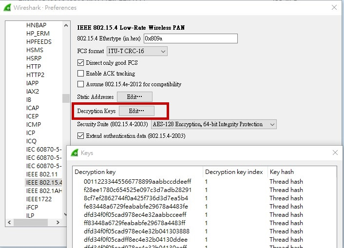
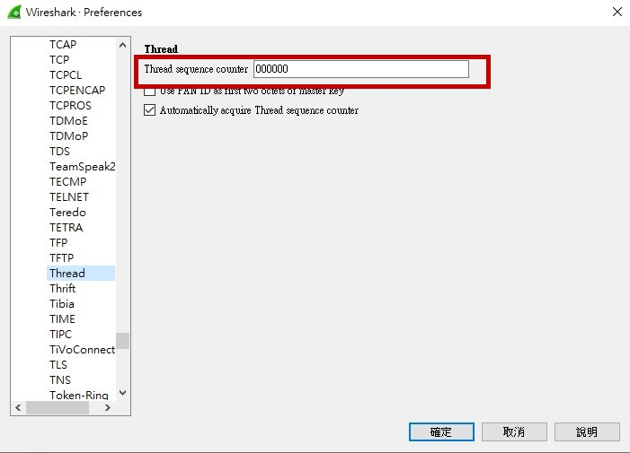
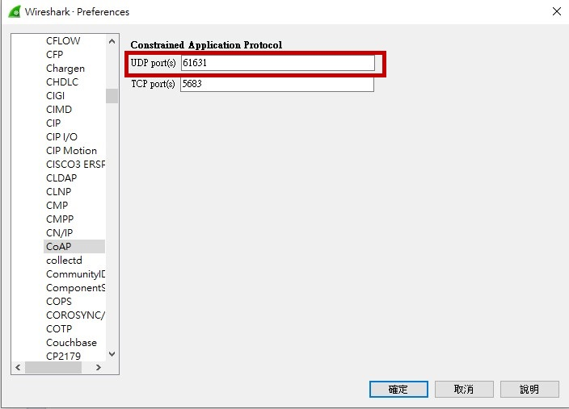

# miu-sniffer Example

## 1. What is the miu-sniffer Example?

The `miu-sniffer` example is based on the OpenThread RCP (Radio Co-Processor). In this example, it is used as a sniffer to capture Thread network packets and display them in Wireshark. The following sections describe how to configure and use this setup.

In the `ncp.c` file, you will find the following configuration:

```c
CONFIG_APP_OT_NCP_OPERATION_UART_PORT
```

By default, this is set to UART0. However, users can change it to `1` to use UART1 for communication with Wireshark.

---

## 2. Sub-GHz Frequency & Data Rate Configuration

The MIU SDK leverages the Rafael RT58x's Sub-GHz capabilities, allowing flexible configuration of frequency bands and data rates. These are defined at **compile-time** using specific configuration macros, typically found in `sdk_config.h` or the project's `CMakeLists.txt`.

* **Frequency Band (e.g., `CONFIG_SUBG_FREQUENCY_BAND_915`)**:
    These macros determine the operating Sub-GHz frequency band for the device. Options include:
    * `CONFIG_SUBG_FREQUENCY_BAND_915` (915 MHz)
    * `CONFIG_SUBG_FREQUENCY_BAND_868` (868 MHz)
    * `CONFIG_SUBG_FREQUENCY_BAND_470` (470 MHz)
    * `CONFIG_SUBG_FREQUENCY_BAND_433` (433 MHz)
    By default, `HOSAL_RF_BAND_SUBG_915M` is often selected.

* **Data Rate (e.g., `CONFIG_SUBG_DATA_RATE_FSK_300K`)**:
    These macros select the physical layer data rate for Sub-GHz communication. Options include:
    * `CONFIG_SUBG_DATA_RATE_FSK_300K` (300 kbps FSK)
    * `CONFIG_SUBG_DATA_RATE_FSK_200K` (200 kbps FSK)
    * `CONFIG_SUBG_DATA_RATE_FSK_100K` (100 kbps FSK)
    * `CONFIG_SUBG_DATA_RATE_FSK_50K` (50 kbps FSK)
    * `CONFIG_SUBG_DATA_RATE_OQPSK_25K` (25 kbps OQPSK)
    The default is often `HOSAL_RF_PHY_DATA_RATE_300K`.

**Important:** For devices to communicate within the same mesh network, they **must be configured with the same frequency band and data rate** during compilation.

---

## 3. Required Tools

Please download and install the following tools:

* **Python (version 3.7 or later)**
  [https://www.python.org/downloads/release/python-379/](https://www.python.org/downloads/release/python-379/)

* **Wireshark**
  [https://www.wireshark.org/download.html](https://www.wireshark.org/download.html)

### Environment Setup

Instead of manually installing dependencies and copying files, you can use the provided automated script:

1. Clone or download the repository from [https://github.com/RafaelMicro/pyspinel.git](https://github.com/RafaelMicro/pyspinel.git).
2. Inside the cloned repository, run `install_sniffer.bat` (Windows). Double-click the file or run it from a Command Prompt. This script will automatically:
    - Verify your Python and Wireshark environment.
    - Install the `pyspinel` library.
    - Deploy `extcap_ot.py` and other necessary files into the correct Wireshark `extcap` directory.

### Figure 1: Extcap Directory
  <p align="center">
    
  </p>

After setup, restart Wireshark and check if the "sniffer" interface appears. If not, go to **Capture → Refresh Interfaces** to rescan available interfaces.

### Figure 2: Capture Interfaces
  <p align="center">
    
  </p>

---

## 4. Wireshark Options Settings

Click the **Gear icon** next to the "OpenThread Sniffer" interface to open the configuration menu:

1. **Min/Max Channel**: Set the boundary according to your compiled Sub-GHz frequency band (e.g., set Min to `1` and Max to `10` for 915MHz).
2. **Channel**: Select your desired capture channel. Ensure it falls within the Min/Max limits.
3. **Baudrate**: The interface automatically detects the baudrate (defaulting to 2Mbps). You can manually override it using the dropdown selector if your firmware uses a different rate.
4. Check **IEEE 802.15.4 TAP** to ensure channel information is included in the pcap output and visible in the Wireshark GUI.
5. Check **Save parameters on capture start** to retain these settings for future use.
6. Click **Start** to begin capturing.

> **Troubleshooting:**
> If you receive a pop-up error stating `[ERROR] Channel X is out of range!`, please verify that your chosen Channel falls strictly within the defined Min Channel and Max Channel limits.

### Figure 3: Channel
  <p align="center">
    
  </p>

---

## 5. Thread Protocol Configuration in Wireshark

Navigate to **Preferences → Protocols** in Wireshark to configure protocol settings.

### 5.1 IEEE 802.15.4

1. Click the `+` button to add a new decryption key.
2. Enter the **Thread Network Master Key** in the **Decryption Key** field.
3. Set the **Decryption Key Index** to `1`.
4. Set **Key Hash** to `Thread hash`.

### Figure 4: IEEE802.15.4 key
  <p align="center">
    
  </p>

### 5.2 Thread

1. Set the **Thread sequence counter** to `00000000`.
2. Uncheck **Use PAN ID as first two octets of master key**.
3. Check **Automatically acquire Thread sequence counter**.

### Figure 5: Thread
  <p align="center">
    
  </p>

### 5.3 CoAP

1. Set the **UDP port** to `61631`.
2. Set the **TCP port** to `5683`.

### Figure 6: UDP
  <p align="center">
    
  </p>

After completing these steps, you will be able to view Thread network packets in Wireshark.

These settings typically only need to be configured once. However, if certain parameters change (such as the IEEE 802.15.4 network key), you will need to update the corresponding settings again.

---

## 6. Next Steps

Now that you've successfully created a basic Mesh network with `miu-sniffer` devices, you can explore more advanced functionalities:

* **Explore other examples:** Learn to run `miu-ftd` or `miu-mtd` to understand different MIU example.
    * [`miu-ftd Example Guide`](miu-ftd-guide.md)
    * [`miu-mtd Example Guide`](miu-mtd-guide.md)
* **Learn about MIU Services:** Dive into Rafael's proprietary OTA features.
    * [`OTA Guide`](../OTA-guide.md)
